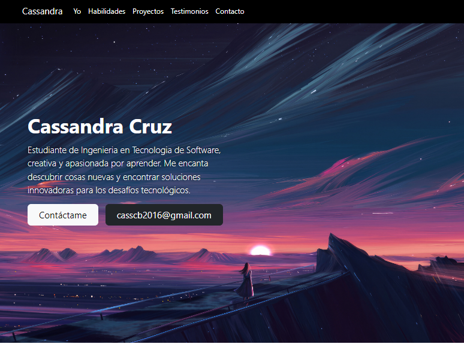
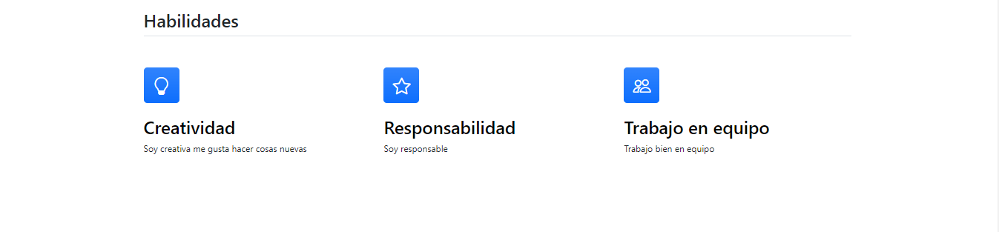
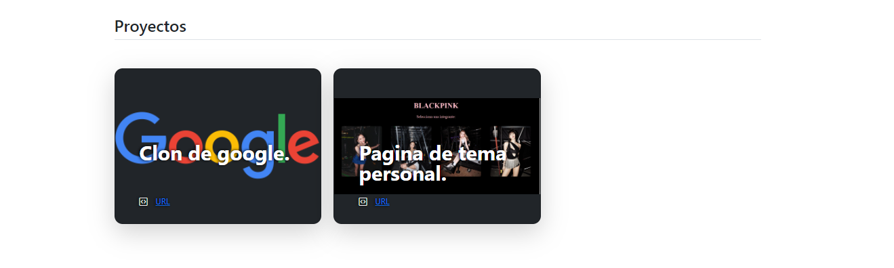
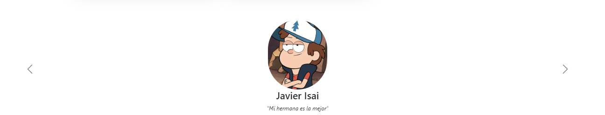

# Mi portafolio de habilidades TECNOLOCHICAS PRO

El presente proyecto es un portafolio desarrollado para poner en practica las habilidades obtenidas dentro del bootcamp de desarrollo frontend de Tecnolochicas PRO.

Fue desarrollado con HTML, CSS Y JS con el uso de el framework de UI, Bootstrap utilizando ademas bibliotecas externas.

La página es responsiva (adaptable a diferentes tamaños de pantalla) e incluye la presentación de la autora del proyecto.

[Proyecto desplegado (https://portafolio-b7-g1-flame.vercel.app/)](https://portafolio-b7-g1-flame.vercel.app/)
---

## Secciones de mi sitio 

## Tecnologia 
* HTML
* CSS
* Bootstrap
* Javascript

---
Desarrollado con  💜 por [Cassandra](https://github.com/Cassandrap04) en [TECHNOLOCHICAS PRO](https://tecnolochicas.mx/)